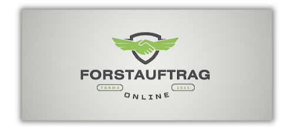
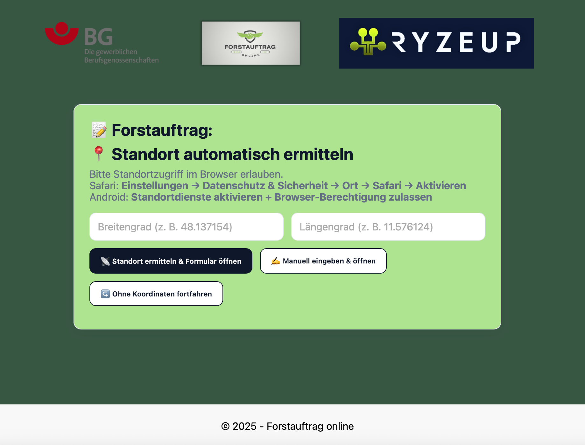
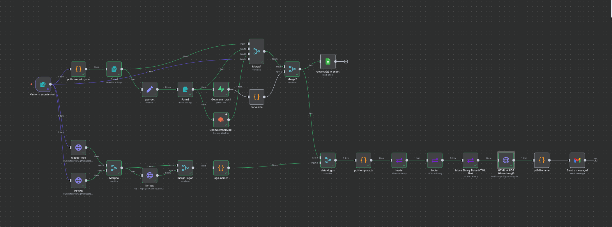
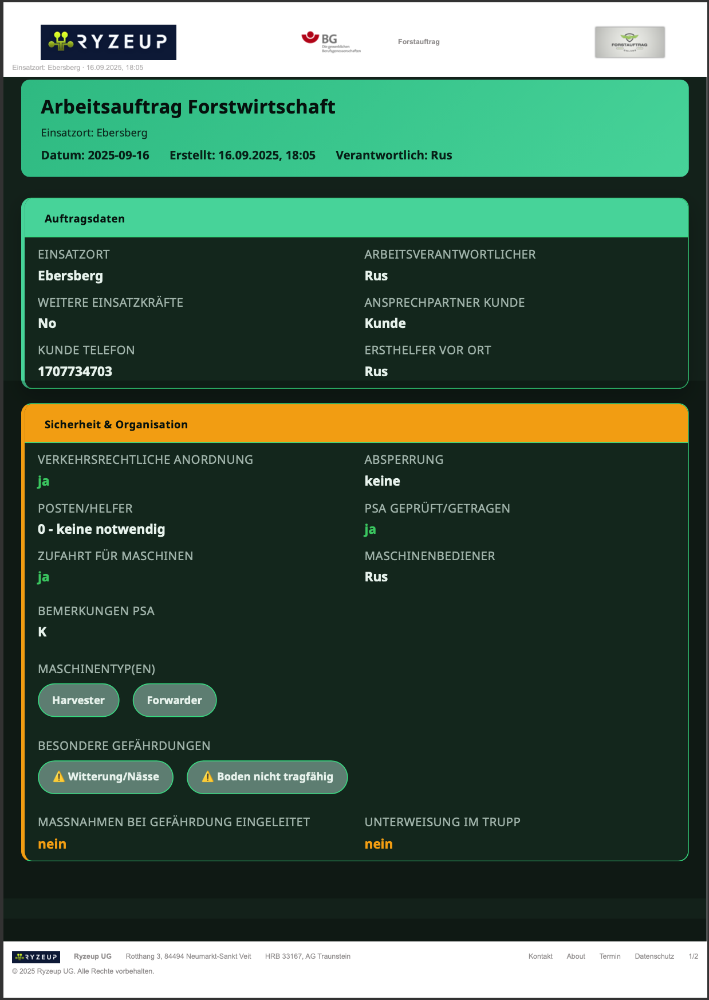
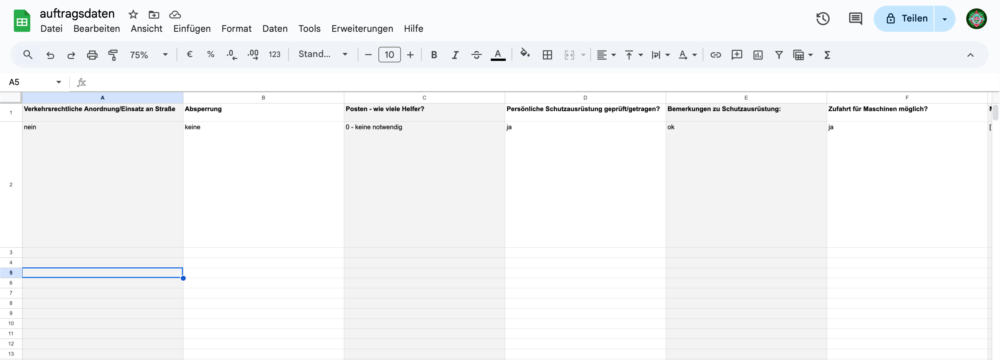

Eine kleine Vorschau des Workflows:


# Forstauftrag – End-to-End Workflow (n8n → Gotenberg PDF)

Dieses Projekt erzeugt aus Web-Formularen (inkl. optionaler GPS-Daten zur automatischen Ermittlung von Rettungspunkten) strukturierte **Arbeitsaufträge als PDF**. Besonderheiten:
- Nutzer wählen in `index.html`, ob und wie GPS geteilt wird.
- n8n sammelt Formular- und Zusatzdaten (Wetter via OpenWeatherMap, Top-3 Rettungspunkte).
- Gotenberg (Chromium) rendert das PDF inkl. **einheitlichem Header/Footer**.
- Ergebnisse können gespeichert, versendet und in Google Sheets geloggt werden.

## Inhaltsverzeichnis
1. [Architektur](#architektur)
2. [Ablauf / Data Flow](#ablauf--data-flow)
3. [Voraussetzungen](#voraussetzungen)
4. [Lokales Setup & Deployment](#lokales-setup--deployment)
5. [Frontend (`index.html`)](#frontend-indexhtml)
6. [n8n Workflow](#n8n-workflow)
7. [PDF-Erzeugung (Gotenberg)](#pdf-erzeugung-gotenberg)
8. [Header/Footer-Design](#headerfooter-design)
9. [GPS & Rettungspunkte](#gps--rettungspunkte)
10. [Wetterdaten](#wetterdaten)
11. [Fehlerbehandlung](#fehlerbehandlung)
12. [Troubleshooting](#troubleshooting)
13. [Screenshots](#screenshots)
14. [Versionierung & Lizenz](#versionierung--lizenz)

---

## Architektur
Browser (index.html)
```
└─► n8n Form (HTTP Form Trigger)
├─ Daten anreichern (GPS → Rettungspunkte, Wetter)
├─ HTML/Head/Foot im Code-Node generieren
├─ Gotenberg: Chromium HTML→PDF
└─ Ausgabe: Datei + Google Sheet + Notification
```


- **Frontend**: `index.html` als Einstiegsseite (Entscheidung zu GPS).
- **n8n**: Workflow-Knoten inkl. `Code`, `Move Binary Data`, `HTTP Request (Gotenberg)`, `Append Row`.
- **PDF**: via `/forms/chromium/convert/html` mit Header/Footer.

## Ablauf / Data Flow

1. **Nutzer-Start (index.html)**  
   Auswahl: Koordinaten automatisch/manuell/ohne GPS → Weiterleitung zum n8n-Form.
2. **Formular in n8n**  
   Eingaben: Einsatzort, Verantwortliche, Sicherheit, etc.
3. **Anreicherung**  
   - GPS → Ermittlung *Top-3 Rettungspunkte*  
   - OpenWeatherMap → Wetterblock
4. **PDF-Generierung**  
   Code-Node erzeugt `html`, `headerTemplate`, `footerTemplate` → Gotenberg rendert.
5. **Persistenz/Versand**  
   Datei speichern (Binary), Google Sheets `Append Row`, optional Notifications.



## Voraussetzungen

- **n8n** >= 1.x (Self-hosted oder Cloud)
- **Gotenberg** v7 (HTTP-Endpoint erreichbar)
- **OpenWeatherMap API Key**
- Google-Konto/Sheet (optional für Logging)
- Node.js nur für lokale Tools (optional)

## Lokales Setup & Deployment

1. Repo klonen und `index.html` hosten (statisch reicht).
2. **n8n**: `workflow.json` importieren.
3. **Credentials** setzen:
   - OpenWeatherMap (HTTP Request / API Key),
   - Gotenberg Base URL (`/forms/chromium/convert/html`).
4. **Umgebungsvariablen** (empfohlen):
   - `OPENWEATHERMAP_API_KEY`
   - `GOTENBERG_URL` (z. B. `https://<...>/forms/chromium/convert/html`)
5. Testlauf: Workflow aus n8n starten → PDF prüfen.

## Frontend (`index.html`)

- Einstiegsseite, in der Nutzer GPS-Sharing festlegen.
- Übergibt `next`-Parameter zum n8n-Form.  
- **Hinweis:** Bei Self-hosting CORS/HTTPS beachten.

(Abbildungen siehe unten)

## n8n Workflow

Wesentliche Nodes:
- **On form submission / Form1/3** – Formularannahme.
- **Harvesine / Rettungspunkte** – Distanz / Auswahl Top-3.
- **OpenWeatherMap1** – Wetterdaten abrufen.
- **Code (Generator)** – baut `html`, `headerTemplate`, `footerTemplate`.
- **Move Binary Data (HTML file)** – legt `html` als `files` (binary) ab.
- **HTML → PDF (Gotenberg)** – rendert PDF.
- **Append row in sheet** – Logging.
- **Code3** – Binary-Metadaten/Dateiendung setzen.

## PDF-Erzeugung (Gotenberg)

- Endpoint: `POST /forms/chromium/convert/html` (multipart/form-data)
- Pflichtfeld: `files` (HTML)
- Empfohlene Optionen:
  - `emulatedMediaType=print`, `preferCssPageSize=true`
  - `printBackground=true`
  - Ränder: `marginTop=24mm`, `marginBottom=30mm`, `marginLeft=20mm`, `marginRight=20mm`
  - `displayHeaderFooter=true`
  - `headerTemplate={{ $json.headerTemplate }}`
  - `footerTemplate={{ $json.footerTemplate }}`

## Header/Footer-Design

Die Templates werden **im Code-Node** definiert (siehe Abschnitt „Design-Tokens“).  
**Vorteile**:
- Einfache Markenanpassung (Farben, Logos, Links),
- Seitenzahl über `<span class="pageNumber"></span>/<span class="totalPages"></span>`,
- Keine externen Requests (bei Data-URL Logos).

> Alternativ: Header/Footer als **separate Dateien** über je einen `Move Binary Data`-Node und zusätzliche Multipart-Felder `header`, `footer`. Die aktuelle In-Template-Variante ist schlanker.

## GPS & Rettungspunkte

- Koordinaten aus Form / Browser.
- Entfernung mit Haversine → Sortierung → *Top-3* in die PDF.
- Kartenlink/„Karte öffnen“ wird im PDF verlinkt.

## Wetterdaten

- Quelle: OpenWeatherMap (aktuelle Beobachtung).
- Angezeigt: Beschreibung, Temperatur, Druck, Wind, Bewölkung.

## Fehlerbehandlung

- **Fehlende Templates** → Kein Header/Footer (setze `headerTemplate` & `footerTemplate` im Code-Node).
- **Chromium schnippelt Header/Footer ab** → Ränder erhöhen (`marginTop/Bottom`); Header/Footer sehr kompakt halten.
- **Leere Werte / „—“** → `pick(...)`-Helper setzt Defaultzeichen.

## Troubleshooting

- **Kein Header/Footer sichtbar**  
  - Prüfe: `displayHeaderFooter=true`  
  - Prüfe: `headerTemplate`, `footerTemplate` tatsächlich **nicht leer**  
  - Ränder groß genug? (`24/30mm` als Start)
- **Seitenzahlen fehlen**  
  - `pageNumber`/`totalPages` müssen im Template enthalten sein (Footer).
- **Logos fehlen**  
  - Data-URL korrekt? ``
- **Schriften**  
  - Nur Web-safe Fonts verwenden oder lokal einbetten (inline `@font-face` → beachten, dass Chromium innerhalb Gotenberg teilweise restriktiv ist).

## Ergebnis Ausgaben
### Automatisch generiertes und gesendetes PDF-Dokuments (Ausschnitt + Link zum ganzen PDF)


[➡️ Zum vollständigen PDF](img/FA_16-09-2025_Ebersberg.pdf)

### Eintrag in ein Google Sheet um Liste zu führen (Beispiel)



```markdown
## Nächste sinnvolle Verfeinerungen (optional)

- **Brand-Switch per Kunde**: THEME als Item-Felder (`theme.brandBg` etc.), um Kunden-Branding dynamisch zu laden.
- **Mehrsprachigkeit**: `lang`-Flag → deutsche/englische Labels im Kopf/Fuß und Inhalt.
- **PDF-QA Node**: automatischer Test, ob Header/Footer-Strings nicht leer sind (Preflight vor Gotenberg).